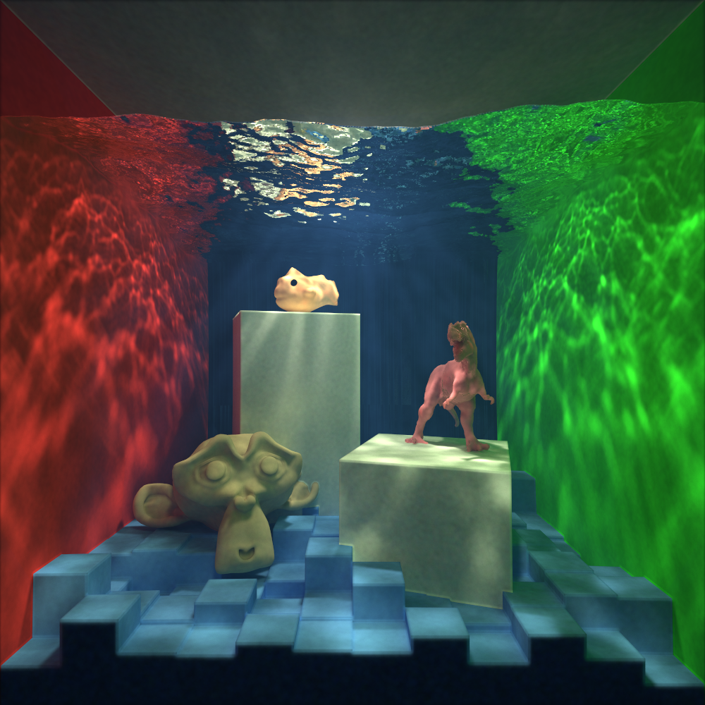

# xian
## Volumetric Renderer Using Photon Maps



## Features

* Surface and Volumetric Photon Mapping for clear caustics
* Path Tracing and Voumetric Path Tracing is also supported
* Multiple OBJ file composition support
* BVH Supporting 100k+ geometric objects


## Requirements and Building
* C++ 17 or higher
* CMake 3.2 or higher

```
mkdir build
cd build
cmake -DCMAKE_BUILD_TYPE=Release ..
make -j
```


## Acknolwedgements 

Code References
* [volppm](https://github.com/yumcyaWiz/volppm) for providing reference on volumetric photon mapping
* [tinyobjloader](https://github.com/tinyobjloader/tinyobjloader) for OBJ loading

Text References, listed in order or relevancy. Much of the code can be found in [1], while the theory is can be found largely covered in [2]. Implementation details are assisted by volppm (above), and [3]4 and [4] are used as reference for Photon Mapping. [5] Contains the approach taken, where a global radius is set across all pixel points similar to the approach taken by volppm. [6], [7], and [8] provide more reference on photon mapping and volumetric rendering theory.

[1] Matt Pharr, Wenzel Jakob, and Greg Humphreys. 2016. Physically Based Rendering: From Theory to Implementation.  
 
[2] Eric Veach. 1997. Robust Monte Carlo Methods for Light Transport Simulation.  

[3] Henrik Wann Jensen, Per H. Christensen, and Jan Henrik Wann Jensen. 2001. Efficient Simulation of Light Transport in Scenes with Participating Media using Photon Maps.  

[4] Henrik Wann Jensen. 1996. Global Illumination using Photon Maps.  

[5] Claude Knaus and Matthias Zwicker. 2011. Progressive Photon Mapping: A Probabilistic Approach.  

[6] Toshiya Hachisuka and Henrik Wann Jensen. 2009. Stochastic Progressive Photon Mapping.  

[7] Toshiya Hachisuka, Shinji Ogaki, Henrik Wann Jensen. 2008. Progressive Photon Mapping.  

[8] Wojciech Jarosz, Derek Nowrouzezahrai, Iman Sadeghi, Henrik Wann Jensen. 2011. A Comprehensive Theory of Volumetric Radiance Estimation Using Photon Points and Beams.  
